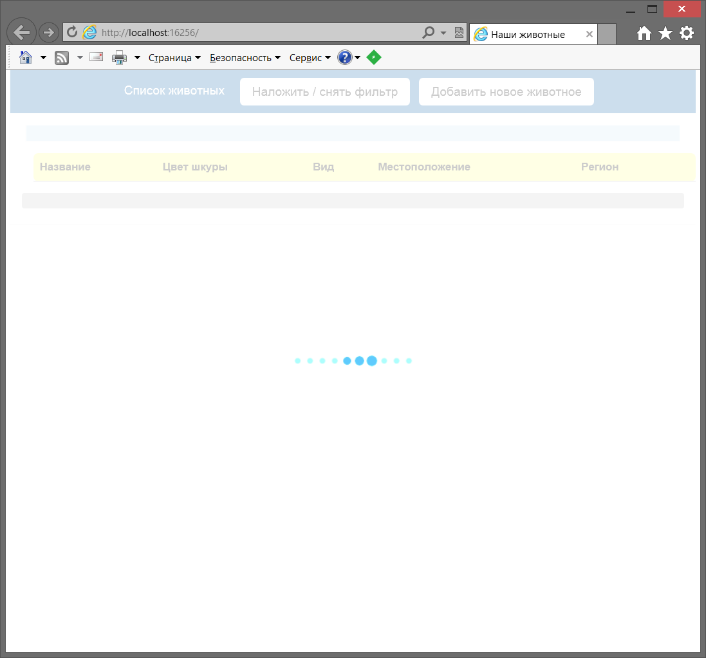
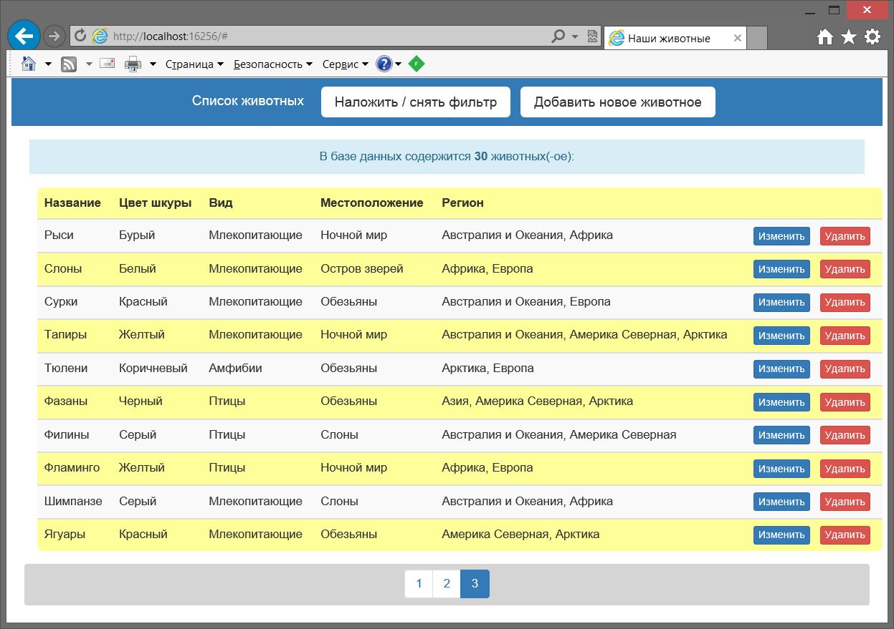
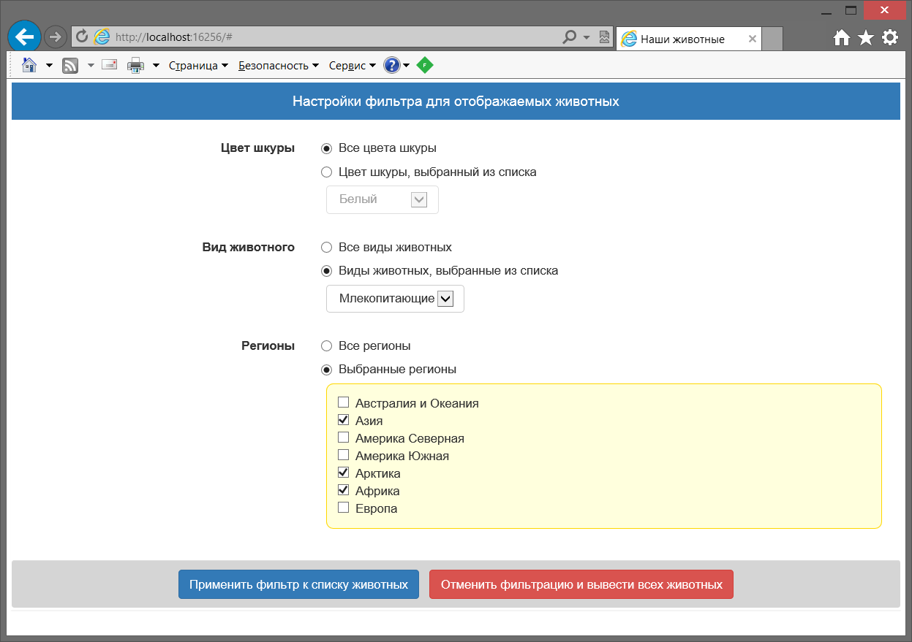
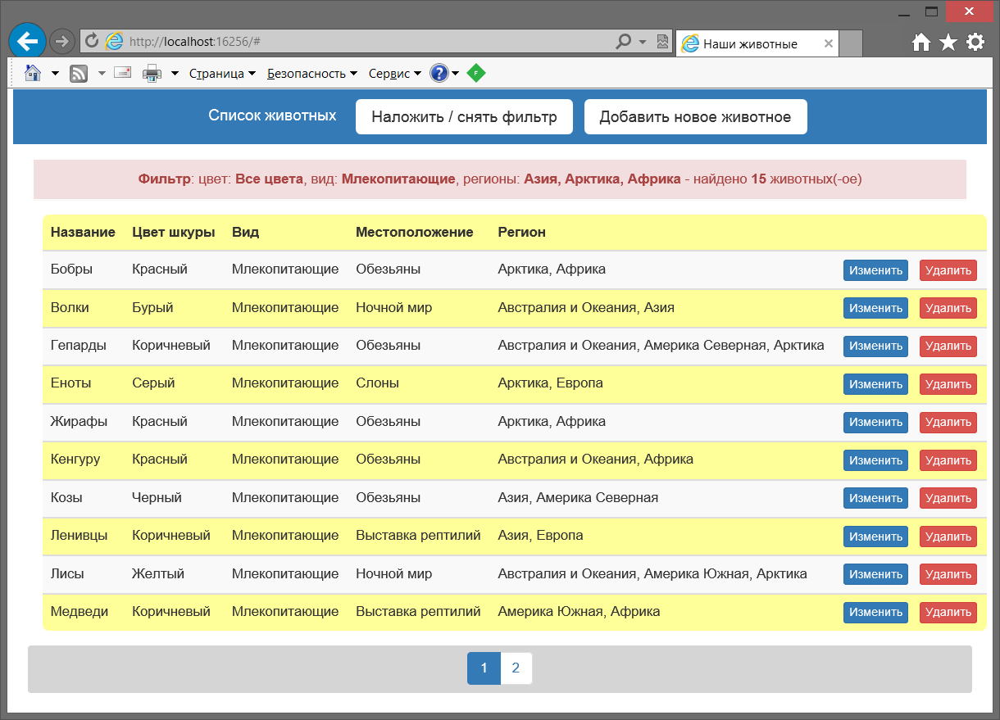
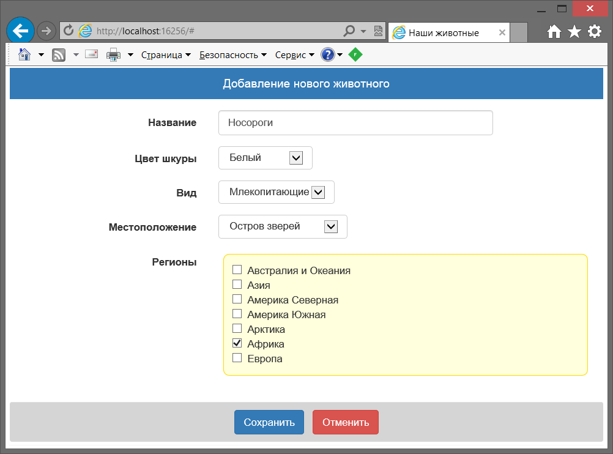
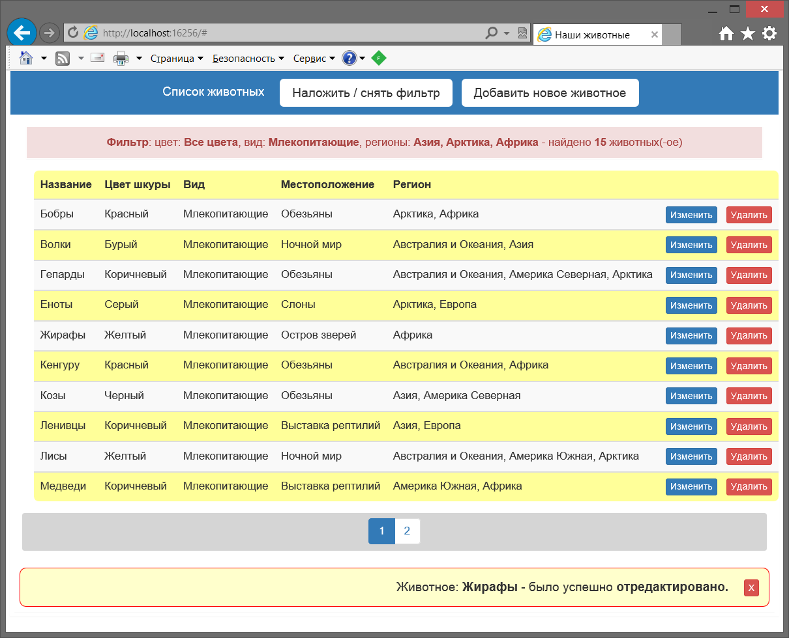
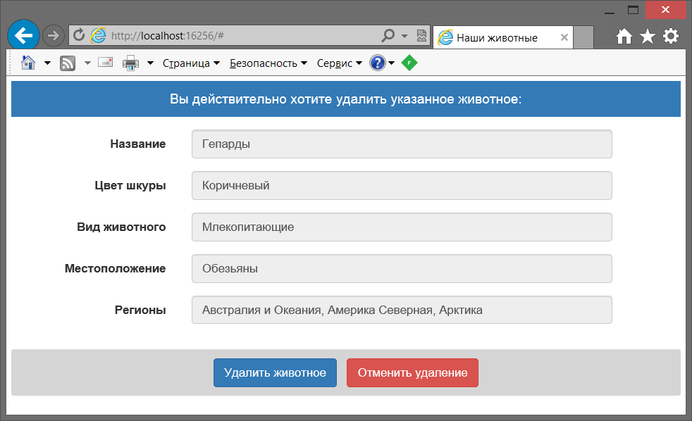

# WebSpaServices

<b>SPA</b> ASP.NET <b>Web API 2</b> application using frameworks: <b>Knockout</b>, <b>EntityFramewok</b>, <b>Ninject</b> and <b>Automapper</b> with <b>Unit Tests</b> project using: <b>EntityFramewok</b>, <b>Ninject</b> and <b>Moq</b> included as well.

Some key code snippets only
 
This <b>SPA</b> application uses <b>Knockout</b> on frontend and <b>Web API 2</b> on backend of nain project.
 
Note than filtering execute at back-end side of this SPA-application (as wished by customer).
 
For <b>Unit</b> testing solution contains additional <b>Test</b> project as well.

Take a look at code for <b>SPA</b> project: 

<b>App_Start</b> folder: 
<ul>
	<li>NinjectWeb Common settings: <a href="App_Start/NinjectWebCommon.cs">NinjectWebCommon.cs</a>.</li>
</ul>

<b>Controllers</b> folder:  
<ul>
  <li>Main Animals Controller: <a href="Controllers/AnimalsController.cs">AnimalsController.cs</a>,</li>
  <li>Default Home Controller: <a href="Controllers/HomeController.cs">HomeController.cs</a>,</li>
  <li>Helper Kinds Controller: <a href="Controllers/KindsController.cs">KindsController.cs</a>,</li>
  <li>Helper Locations Controller: <a href="Controllers/LocationsController.cs">LocationsController.cs</a>,</li>
  <li>Helper Regions Controller: <a href="Controllers/RegionsController.cs">RegionsController.cs</a>,</li>
  <li>Helper Skins Controller: <a href="Controllers/SkinsController.cs">SkinsController.cs</a>.</li>  
</ul>

<b>Models</b> folder (data models and interfaces): 
<ul>
  <li><a href="Models/Animals.cs">Animals.cs</a>,</li>
  <li><a href="Models/AnimalsContext.cs">AnimalsContext.cs</a>,</li>
  <li><a href="Models/AnimalsDbInitializer.cs">AnimalsDbInitializer.cs</a>,</li>
  <li><a href="Models/AnimalsRepository.cs">AnimalsRepository.cs</a>,</li>
  <li><a href="Models/IRepository.cs">IRepository.cs</a>,</li>
  <li><a href="Models/IRepositoryFactory.cs">IRepositoryFactory.cs</a>.</li>  
</ul>

<b>Utils</b> folder: 
<ul>
   <li>Profile for Automapper: <a href="Utils/AutomapperProfile.cs">AutomapperProfile.cs</a>,</li>
   <li>Cache attribute class: <a href="Utils/CacheFilter.cs">CacheFilter.cs</a>,</li>
   <li>Resolver for Ninject: <a href="Utils/NinjectDependencyResolver.cs">NinjectDependencyResolver.cs</a>.</li>
</ul>

<b>Views</b> folder (only single view): 
<ul>
  <li>Main view for <b>SPA</b> front-end <a href="Views/Index.cshtml">Index.cshtml</a>.</li>
</ul>

Take a look at code for <b>Test</b> project: 

<b>Controllers</b> folder:  
<ul>
  <li>Tests for Animals Controller: <a href="Tests/Controllers/AnimalsControllerTest.cs">AnimalsControllerTest.cs</a>,</li>
  <li>Tests for Skins Controller: <a href="Tests/Controllers/SkinsControllerTest.cs">SkinsControllerTest.cs</a>.</li>
</ul>

Here are some screenshots:

<b>Main</b> window (while loading data):

 

<b>Main</b> window  (data was loaded):

 

<b>Filter</b> panel screenshot:

 

<b>Main</b> window  (data was filtered):

 

<b>Adding Animal</b> panel screenshot:

 

<b>Main</b> window  (after animal was edited):

 

<b>Deleting Animal</b> panel screenshot:

 

